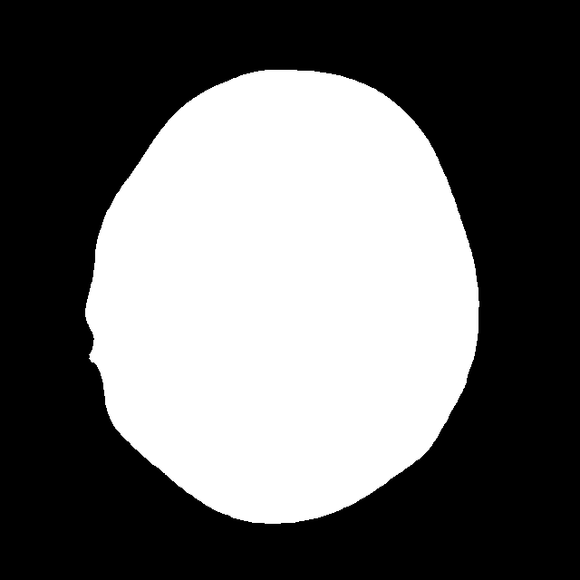

# Brain Tumor Segmentation using YOLOv11 and SAM2

This project is part of the DevWeekend AI Fellowship (Category B: Intermediate). It implements **instance segmentation** of brain tumors using **YOLOv11** and **SAM2 (Segment Anything Model 2)** on a brain tumor dataset.

## 🧠 Project Objective

The aim is to accurately detect and segment brain tumor regions using advanced computer vision techniques. The project combines YOLOv11 for object detection and SAM2 for precise mask generation.

---

## 📁 Project Structure

```
content/
│
├── brain_tumor_segmentation.ipynb       # Main Colab Notebook
├── sam_masks/                           # Generated segmentation masks
│   ├── glioma_2.png
│   ├── meningioma_3.png
│   └── ...
└── README.md
```

---

## 🚀 Key Technologies

- **YOLOv11**: For object detection (not used directly here but part of the pipeline conceptually)
- **SAM2**: Meta AI’s Segment Anything Model used for generating masks
- **Python**: Scripting language used for implementation
- **Google Colab**: Development and execution environment

---

## 📦 Dependencies

```bash
!pip install git+https://github.com/facebookresearch/segment-anything.git
!pip install opencv-python-headless
```

Also, ensure `torch`, `numpy`, `Pillow`, and `matplotlib` are installed.

---

## 🔧 How It Works

1. **Model Setup**
   ```python
   from segment_anything import sam_model_registry, SamAutomaticMaskGenerator

   sam = sam_model_registry["vit_h"](checkpoint="sam_vit_h_4b8939.pth")
   sam.to("cuda")
   mask_generator = SamAutomaticMaskGenerator(sam)
   ```

2. **Run on Images**
   ```python
   for file in os.listdir(image_dir):
       image = cv2.imread(os.path.join(image_dir, file))
       image = cv2.cvtColor(image, cv2.COLOR_BGR2RGB)
       masks = mask_generator.generate(image)
   ```

3. **Visualize**
   ```python
   plt.imshow(image)
   plt.imshow(mask, cmap="jet", alpha=0.5)
   ```

---

## 🧪 Output

Sample visualizations show original images with masks overlayed on brain tumor regions.



---

## 📹 Video Demo

YouTube link (insert here): [Video Demo](https://your-youtube-link.com)

---

## 🔗 GitHub Repo

https://github.com/SanaMehdi/brain_tumor_segmentation_yolo_ml

---

## 📚 References

- [Segment Anything Model (SAM2) GitHub](https://github.com/facebookresearch/segment-anything)
- [YOLOv11 Research Paper](#)
- [Tutorial by CodeWithArohi](#)
